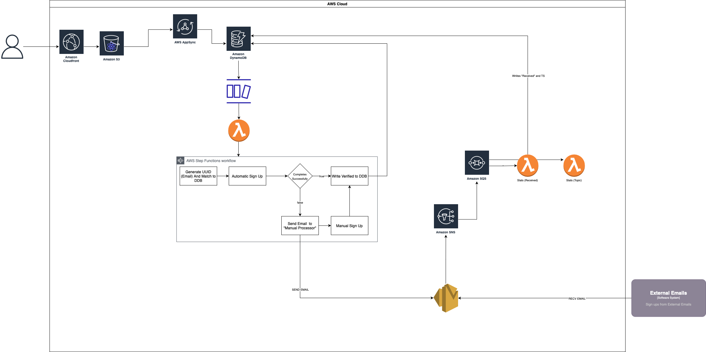

# Lunch Meat

Lunch meat is an automated workload that provides some statistics around How your email is used when signing up for a service. 

It is an example of a completely serverless first workload.

It uses SES Email Receiving, alongside DynamoDB for Data Storage to provide insights into things like frequency of emails, whether emails are spam, and the domains to which the emails are sent from. 

The intent of this was to identify overly optimistic promotional emails, and more broadly to check whether a company sells your email address. 

In the future, I would like to expand this to try to extract promotional codes from emails and provide them. This would be through Sagemaker, possibly. 

For now I think it is a nice example of a completely serverless workload, using AppSync for the api. I hope that it stands as an example of how to architecture applications like this in the future.

It uses the CDK as a IAAC code tool. 

## Technology Used

* AppSync (GraphQL + Javascript Resolvers)
* DynamoDB
* Amazon SES 
* S3
* Cloudfront & S3 Hosting
* Lambda
* Athena
* React 
* D3.js
* CDK

## Architectural Diagram

[]

## Working Example

A working example of this application can be accessed at https://lm.podginator.com

